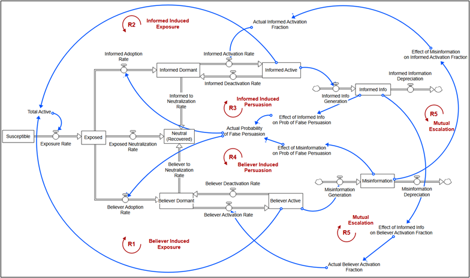

## Dynamic Analysis of False Information Spread Over Social Media: 5G-COVID 19 Conspiracy Theory
 
### Abstract

The spread of false information via online social networks is a critical societal
issue with various potential harms. Although there are huge efforts both in research
and application to mitigate this problem, it persists with an increasing magnitude of
results ranging from political manipulation to violent attacks. In our research, we built
a causal simulation model to combine the existing accumulated knowledge in the literature
and provide a formal model to evaluate the governing dynamics for the specific
case of the viral spread of the 5G-COVID-19 conspiracy theory. The model makes
use of both qualitative and quantitative data and successfully generates the observed
dynamics for the 5g narrative. Results from the base run suggest that the dominance
of believers in the active discussion on social media is overrepresented relative to the
total population. Moreover, common mitigation strategies proposed in the literature
such as limiting the interaction with believers of the misinformation often seem to produce
worse outcomes for specific cases which indicates policy resistance. In addition,
scenario analysis suggests that the involvement of neutral people in sharing misinformation
or superspreader actors might be enough to induce the system to pass the tipping
point and generate an infodemic. The current analysis presents several trade-offs while
discussing the underlying reasons through posterior analysis. In further research, we
plan to expand our analysis by the inclusion of other user profiles, experiment with
other mitigation strategies, and discuss the potential similarities and differences of our
case with other types of false information dynamics.

### [Conference Paper](ISDC-2022-Barry-Richmond-Application.pdf)
### [Thesis](MSc_Thesis_of_Orkun.pdf)
